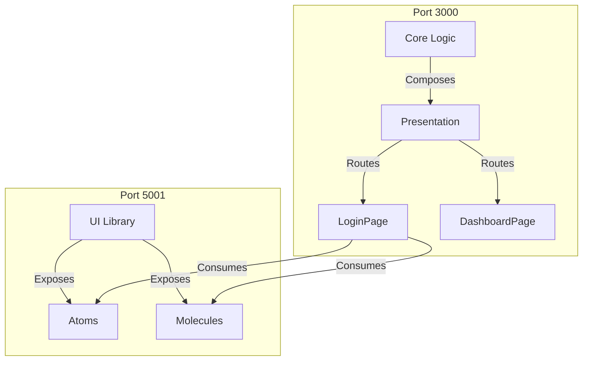

# Boilet Plate Microfrontend Boilerplate

**Objective**: To provide a production-ready, scalable foundation for large-scale React applications using  **Microfrontend Architecture**. 

This boilerplate integrates **Clean Architecture (Uncle Bob)**, **Atomic Design**, and **Module Federation** to solve common enterprise challenges: maintainability, testing, and independent deployment.

## 🌟 Key Features

*   **Microfrontend Architecture**: Host application consumes remote components via Module Federation.
*   **Clean Architecture**: Strict separation of concerns (Domain, Use Case, Infrastructure, Presentation).
*   **Atomic Design**: Reusable UI components organized into Atoms, Molecules, and Organisms.
*   **Dependency Injection**: Centralized registry for managing dependencies (e.g., swapping Mock vs Real API).
*   **Authentication & State**: Robust auth flow with `Zustand` (persisted) and `Axios` interceptors.
*   **Theming**: Dark/Light mode support with Tailwind CSS.
*   **Type Safety**: 100% TypeScript coverage across all layers.

---

---

## 🏗️ Architecture Overview

### 🗺️ System Diagram



### 🧠 Clean Architecture (Host App)

The host application follows a strict dependency rule where inner layers know nothing about outer layers.

```mermaid
graph TD
    subgraph Infrastructure [Infrastructure Layer]
        API[ApiClient (Axios)]
        RepoImpl[RealAuthRepository]
    end

    subgraph Interface_Adapters [Interface Adapters]
        RepoInt[IAuthRepository]
        Store[Zustand Store]
    end

    subgraph Application_Business_Rules [Use Case Layer]
        UseCases[AuthLoginUseCase]
    end

    subgraph Enterprise_Business_Rules [Domain Layer]
        Entities[User Entity]
    end

    Infrastructure --> Interface_Adapters
    Interface_Adapters --> Application_Business_Rules
    Application_Business_Rules --> Enterprise_Business_Rules
```

### 1. Host Application (`apps/host`)
The main container application ("Web App").
*   **Port**: `3000`
*   **Role**: Application Logic, Routing, Page Composition.
*   **Layers**:
    *   `core/domain`: Entities (`User`) & Interfaces (`IAuthRepository`).
    *   `core/usecases`: Pure business logic (`AuthLoginUseCase`).
    *   `core/infrastructure`: `ApiClient` (Axios) and Repositories (`RealAuthRepository`).
    *   `presentation`: Atomic Pages (`LoginPage`) and Organisms (`LoginForm`).

### 2. Remote Application (`apps/remote`)
The UI Component Library ("Remote App").
*   **Port**: `3001` (Dev) / `5001` (Preview)
*   **Role**: Exposing reusable Atomic Design components.
*   **Exports**:
    *   **Atoms**: `Button`, `Input`, `Label`
    *   **Molecules**: `FormField`, `ThemeToggle`

### 3. Shared Technology
*   **Build Tool**: Vite + SWC
*   **Styling**: Tailwind CSS
*   **State**: Zustand
*   **Networking**: Axios

---

## 🚀 Getting Started

### Prerequisites
*   Node.js >= 18
*   pnpm >= 8

### Installation
```bash
pnpm install
```

### Running in Development (Mock Mode)
Ideal for frontend development without backend dependencies.

1.  **Start Remote App:**
    *Note: We run `preview` for the remote to serve the built assets on port 5001.*
    ```bash
    pnpm --filter remote-app build
    pnpm --filter remote-app preview
    ```
    *Runs on http://localhost:5001*

2.  **Start Host App:**
    ```bash
    pnpm --filter web-app dev
    ```
    *Runs on http://localhost:3000*

**Mock Credentials:**
*   **Admin**: `admin@example.com` / `admin123`
*   **User**: `user@example.com` / `user123`

### Running in Production (Real API)
To connect to a real backend:

1.  **Configure Environment:**
    Edit `.env.production` in `apps/host`:
    ```env
    VITE_USE_MOCK=false
    VITE_API_URL=https://your-api.com/v1
    ```

2.  **Build & Run:**
    ```bash
    pnpm --filter remote-app build
    pnpm --filter remote-app preview
    pnpm --filter web-app build
    pnpm --filter web-app preview
    ```

---

## 🛠️ Docker Deployment

Full stack orchestration using Docker Compose.

```bash
# Build and start all services
docker-compose up --build

# Stop services
docker-compose down
```

---

## 🧩 Project Structure

```
monorepo/
├── apps/
│   ├── host/                 # Host Application (Web App)
│   │   ├── src/
│   │   │   ├── core/         # Clean Architecture Layers
│   │   │   ├── presentation/ # Pages & Local Components
│   │   │   └── registry.ts   # Dependency Injection Root
│   │   └── remote.d.ts       # Module Federation Types
│   │
│   └── remote/               # Remote Application (UI Lib)
│       └── src/
│           └── components/   # Atomic Design (Atoms, Molecules)
│
├── packages/                 # Shared logic (Optional)
├── docker-compose.yaml       # Orchestration
└── README.md                 # Documentation
```

## 🐛 Troubleshooting

*   **Connection Refused (Port 5001)**: Ensure you are running the remote app with `pnpm preview` (not just `dev`), as the host expects the built artifact.
*   **Sign In Button Issue**: Ensure the remote app is rebuilt if you changed component logic (e.g., `type="submit"` fix).
